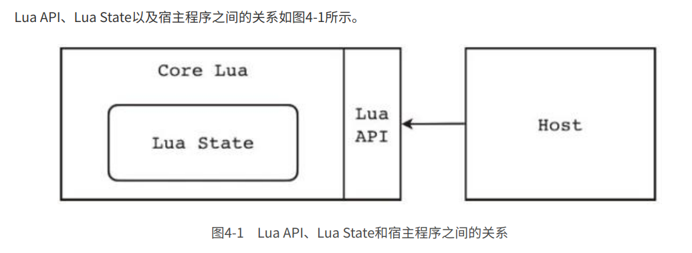

## 注意

学习《自己动手写Lua虚拟机》记录。

代码为该书提供代码。

### lua chunk 检查

- 版本
- 格式
- lua data
- 类型大小
- 大小端

## Lua 5.3

### 虚拟机
- 高级编程语言虚拟机是对真实计算机的模拟和抽象。
- 基于栈（Stack Based）和基于寄存器（Register Based）。
- Lua虚拟机则是基于寄存器的虚拟机（实际上Lua在5.0版之前使用的也是基于栈的虚拟机，不过从5.0版开始改成了基于寄存器的虚拟机。
- 基于栈的虚拟机需要使用PUSH类指令往栈顶推入值，使用POP类指令从栈顶弹出值，其他指令则是对栈顶值进行操作，因此指令集相对比较大，但是指令的平均长度比较短；基于寄存器的虚拟机由于可以直接对寄存器进行寻址，所以不需要PUSH或者POP类指令，指令集相对较小，但是由于需要把寄存器地址编码进指令里，所以指令的平均长度比较长。
- 按照指令长度是否固定，指令集可以分为定长（Fixed-width）指令集和变长（Variable-width）指令集两种。

### lua state

在语言层面，Lua一共支持8种数据类型，分别是nil、布尔（boolean）、数字（number）、字符串（string）、表（table）、函数（function）、线程（thread）和用户数据（userdata）。

